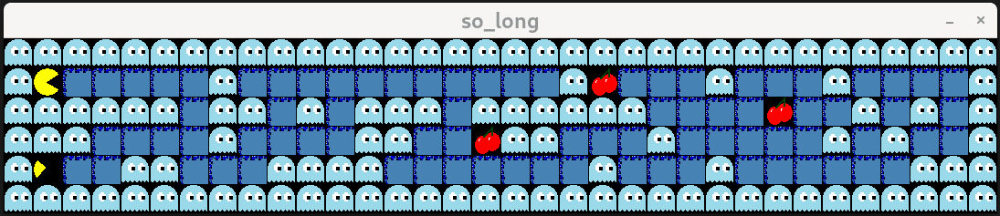
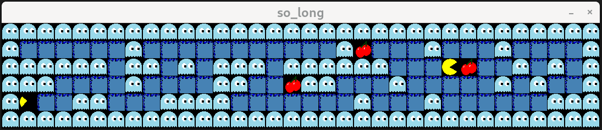

# 🎮 So_long  

**So_long** is a simple 2D game developed using `minilibx-linux`, a minimalistic graphics library commonly used in educational projects. This project combines 2D graphics, game logic, and event handling, providing a practical experience in low-level technologies and essential programming concepts for graphical applications. 





---

## ✨ Project Objectives  

- ✅ Create a functional 2D game with basic rules.  
- ✅ Explore the use of `minilibx-linux` for rendering graphics and handling events.  
- ✅ Develop skills in project organization, writing clean code, and documentation.  
- ✅ Deliver a clear, ready-to-run project for Linux systems.  

---

## 🕹️ Key Features  

- **🎯 Goal:** The player controls a character that must collect all items on the map and reach the exit to win.  
- **⚙️ Events:**  
  - Player movement (⬅️➡️⬆️⬇️ arrow keys).  
  - Collision detection with walls or other elements.  
  - Progress tracking (items collected and steps taken).  
- **🗺️ Map:**  
  - Represented in a `.ber` file (text-based map).  
  - Format includes:  
    - `1` for walls.  
    - `0` for walkable paths.  
    - `P` for the player's starting position.  
    - `C` for collectible items.  
    - `E` for the exit.

---

💻 Technical Requirements
- 🖥️ Operating System: Linux.
- 📦 Libraries:
  - minilibx-linux
  - libx11 and other required graphics dependencies.

- 🛠️ Compiler: gcc compatible with your system.
- 🔧 Additional Tools:
  - make for building the project.
  - valgrind for memory analysis (optional).
  
---
## 🚀 How to Run the Project 
1. Clone the Repository:
```bash
git clone https://github.com/davx00/so_long.git
cd so_long
```
2. Build the Project:
```bash
make
```
3. Run the Game:
```bash
./so_long maps/map_pacman.ber
```
4. Game Controls:
- Arrow Keys: Move the character.
- ESC Key: Close the game.

## 🎮 How to Use the Game
1. Understand the Objective:
Collect all the collectible items (C) scattered across the map. Navigate the
player (P) to the exit (E) after collecting all items to win.
2. Gameplay:
Use the arrow keys to move the character on the map. Avoid walking into walls
(1) as they block your path. Progress is tracked in terms of steps taken and
items collected.
3. Custom Maps:
Create your own .ber map files and place them in the maps/ folder. The map must
follow this format:
- Must be rectangular.
- Contain exactly one player (P) and one exit (E).
- Include at least one collectible item (C).
Run the game with your custom map:
```bash
./so_long maps/map_pacman.ber
```

## 📂 Project Structure  

```plaintext
so_long/
├── assets/                  # Resource files (sprites, images)
├── src/                     # Source code
│   ├── main.c               # Program entry point
│   ├── map_parser.c         # Map loading and validation logic
│   ├── player.c             # Player logic management
│   ├── render.c             # Graphics rendering
│   ├── events.c             # Keyboard event handling
│   └── utils.c              # Helper functions
├── include/                 # Header files
│   ├── so_long.h            # Global definitions
│   └── keys.h               # Key macros
├── maps/                    # Map files in .ber format
│   └── example_map.ber
├── tests/                   # Unit tests
├── diagrams/                # Explanatory diagrams
│   └── architecture.png
├── Makefile                 # Build script
├── README.md                # Project documentation
└── .gitignore               # Ignored files

